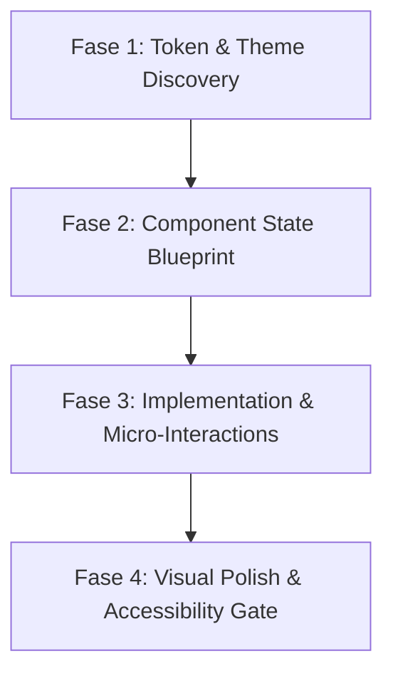

# Workflow: Design de Interface & Experiência de Alta Fidelidade (/design)

> **Gatilho:** `/design`, novas telas, componentes visuais, redesigns, ajustes de layout ou melhorias estéticas.  
> **Filosofia:** Qualidade de nível Linear, Apple HIG, v0 e Lovable. Proibido código visual sem ancoragem de tokens e sem ciclo completo de estados.

---

## 🧭 As 4 Fases Obrigatórias de Execução

---

### Fase 1: Token & Theme Discovery (Ancoragem Prévia)
**Regra de Ouro:** A IA NUNCA gera código visual antes de inspecionar o Design System existente no projeto.

1. **Localizar e Ler o Design System do Projeto:**
   * Inspecione arquivos de tema ativos: `tokens.ts`, `theme.ts`, `ThemeContext.tsx`, `tailwind.config.*`, ou variáveis CSS (`globals.css`).
   * Extraia as constantes semânticas:
     - Paleta de cores (`background`, `surface`, `border`, `primary`, `textPrimary`, `textMuted`, `accent`).
     - Escala de raios de borda (`radius.sm`, `radius.md`, `radius.lg`, `radius.pill`).
     - Tipografia oficial (`fonts`, `sizes`, `weights`).
2. **Proibição de Hexadecimais Arbitrários:**
   * É terminantemente proibido inventar valores como `#3b82f6` ou `#1e293b` se o projeto já tiver tokens definidos. Use sempre as variáveis semânticas do tema.

---

### Fase 2: Component State Blueprint (Máquina de 6 Estados)
Antes de escrever o código final, declare e cubra os 6 estados obrigatórios:

| Estado | Comportamento Obrigatório |
|---|---|
| **1. Default** | Visual limpo, alinhamento com escala de 8pt (4, 8, 12, 16, 24, 32, 48px). |
| **2. Hover / Focus** | Realce sutil de contraste (ex: border ou background shift) + anel visível de foco (`focus-visible:ring-2`) para navegação por teclado. |
| **3. Active / Pressed** | Feedback tátil imediato (ex: `scale(0.98)` ou `active:opacity-80`) com transição suave (150ms). |
| **4. Loading** | Skeleton / Shimmer real que preserva o layout exato do conteúdo, nunca apenas um spinner isolado no vazio. |
| **5. Empty State** | Ilustração ou ícone semântico, mensagem encorajadora e ação clara de chamada (CTA) para o primeiro uso. |
| **6. Error State** | Borda de alerta sutil, mensagem de causa amigável e botão de reintento (*Retry*). |

---

### Fase 3: Implementation & Micro-Interactions
Construa o componente aplicando padrões modernos de engenharia visual:

1. **Ergonomia Móvel & Viewport Real:**
   * **Touch Targets:** Todo elemento clicável em telas touch deve ter área de toque mínima de **48x48px** (ou padding compensatório).
   * **Teclado Seguro:** Formulários e inputs devem ser envolvidos em `KeyboardAvoidingView` com `contentContainerStyle` que previna sobreposição de docks flutuantes.
   * **Viewport Moderna:** Em web, use sempre `min-h-[100dvh]` em vez de `h-screen`.
   * **Safe Areas:** Respeite sempre `useSafeAreaInsets` no topo (notch/dynamic island) e base (home bar).
2. **Matemática Concêntrica de Bordas:**
   * Em molduras ou cards aninhados:
     $$\text{radius}_{\text{interno}} = \max(0, \text{radius}_{\text{externo}} - \text{padding})$$
3. **Escala de Espaçamento Estrita:**
   * Utilize múltiplos de 4px/8px: `gap-1 (4px)`, `gap-2 (8px)`, `gap-3 (12px)`, `gap-4 (16px)`, `gap-6 (24px)`, `gap-8 (32px)`. Proibido valores ímpares aleatórios (`gap-[17px]`).

---

### Fase 4: Visual Polish & Accessibility Gate (Design Linter)
Antes de finalizar a resposta, faça a auto-inspeção contra os 6 itens críticos:

- [ ] **Contraste WCAG AA:** O texto possui contraste de no mínimo 4.5:1 contra o fundo?
- [ ] **Hierarquia Clara:** O olhar do usuário sabe imediatamente qual é o elemento principal, secundário e auxiliar?
- [ ] **Sem Slop de IA:** Eliminados gradientes roxos sem propósito, 3 cards idênticos ou bordas invisíveis sem contraste?
- [ ] **Clareza nos Textos:** Botões com verbos de ação claros (`Salvar Evento`, `Criar Conta`) e sem travessões longos (`—`)?
- [ ] **Feedback Tátil:** Todos os elementos interativos possuem transição definida (`transition-all duration-150`)?
- [ ] **Responsividade Testada:** O layout quebra em telas de 375px (iPhone SE) ou desktop ultrawide?
