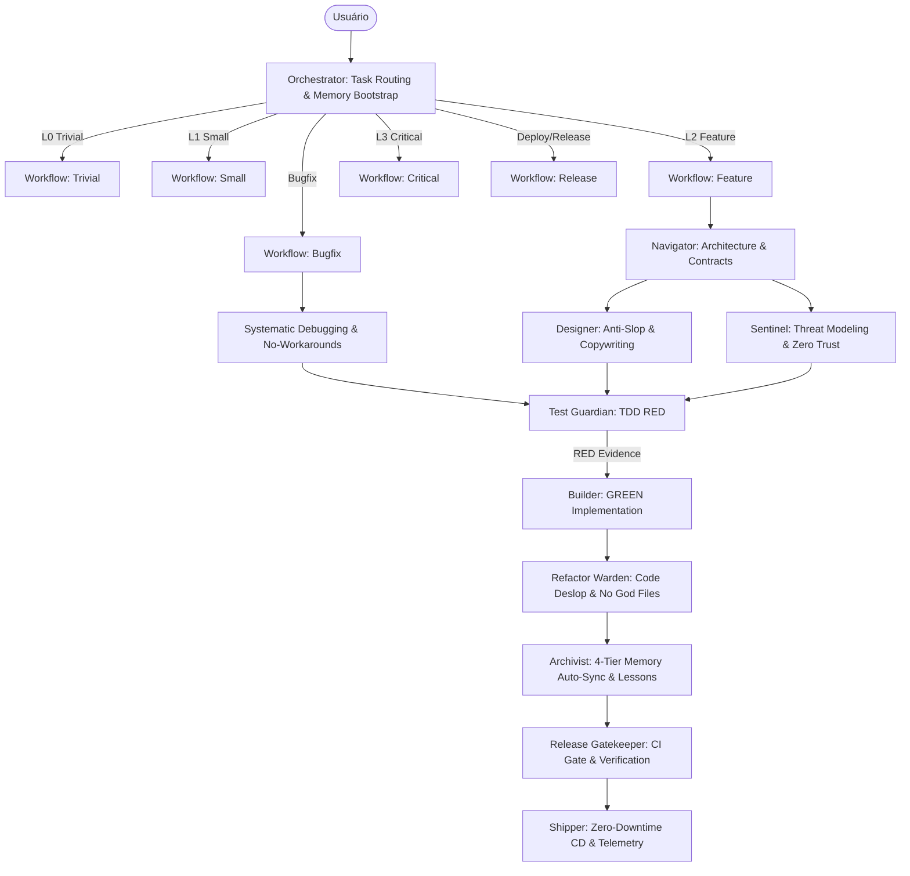

# Regras Globais do Antigravity para o XP Multi-Agent Kit v2

Este arquivo impõe as disciplinas, metodologias essenciais e o mapa arquitetural completo do **XP Multi-Agent Kit v2**. Estas regras e referências cruzadas devem ser aplicadas estritamente a todo trabalho feito pelo Antigravity.

---

## 1. Estratégia de Execução e Roteamento de Tarefas (A Regra de Ouro)
- **Regra de Ouro:** SEMPRE use o menor número de agentes, skills e etapas necessárias para produzir uma alteração correta, testada, segura, acessível, observável e sustentável.
- NÃO pule direto para o código. Primeiro, classifique o risco da tarefa (**L0 a L3**) e identifique as superfícies impactadas (**Capability Routing**).
- Dependendo do risco, acione o workflow apropriado ou simule os agentes necessários ([orchestrator](file:///home/andrevmp/Downloads/xp-multiagent-kit/.agents/agents/orchestrator/agent.md), [navigator](file:///home/andrevmp/Downloads/xp-multiagent-kit/.agents/agents/navigator/agent.md), [sentinel](file:///home/andrevmp/Downloads/xp-multiagent-kit/.agents/agents/sentinel/agent.md), [designer](file:///home/andrevmp/Downloads/xp-multiagent-kit/.agents/agents/designer/agent.md), [test-guardian](file:///home/andrevmp/Downloads/xp-multiagent-kit/.agents/agents/test-guardian/agent.md), [builder](file:///home/andrevmp/Downloads/xp-multiagent-kit/.agents/agents/builder/agent.md), [refactor-warden](file:///home/andrevmp/Downloads/xp-multiagent-kit/.agents/agents/refactor-warden/agent.md), [archivist](file:///home/andrevmp/Downloads/xp-multiagent-kit/.agents/agents/archivist/agent.md), [release-gatekeeper](file:///home/andrevmp/Downloads/xp-multiagent-kit/.agents/agents/release-gatekeeper/agent.md), [shipper](file:///home/andrevmp/Downloads/xp-multiagent-kit/.agents/agents/shipper/agent.md), [genesis](file:///home/andrevmp/Downloads/xp-multiagent-kit/.agents/agents/genesis/agent.md)).

---

## 2. Política de Test-Driven Development (TDD), Diversidade de Testes & Anti-Test-Bypass
- **Ciclo ESTRITO:** RED -> GREEN -> REFACTOR ([tdd policy](file:///home/andrevmp/Downloads/xp-multiagent-kit/.agents/policies/tdd.md)).
- NENHUM comportamento de produção é implementado sem um teste prévio falhando (exceto spikes descartáveis explícitos).
- **Matriz de Diversidade de Testes (Multi-Layer Testing):** Diversifique os tipos de teste conforme a superfície e o risco:
  - *Unitários:* Lógica pura, domínio e funções utilitárias ([tdd-safety-net](file:///home/andrevmp/Downloads/xp-multiagent-kit/.agents/skills/tdd-safety-net/SKILL.md)).
  - *Integração:* Fronteiras reais (banco de dados, transações, filas, APIs HTTP, serializers) ([integration-testing](file:///home/andrevmp/Downloads/xp-multiagent-kit/.agents/skills/integration-testing/SKILL.md)).
  - *Contrato:* Validação de schemas e compatibilidade entre frontend e backend ([api-contracts](file:///home/andrevmp/Downloads/xp-multiagent-kit/.agents/skills/api-contracts/SKILL.md)).
  - *Regressão:* Reprodução exata de bugs antes de qualquer fix ([systematic-debugging](file:///home/andrevmp/Downloads/xp-multiagent-kit/.agents/skills/systematic-debugging/SKILL.md)).
  - *End-to-End (E2E):* Fluxos críticos de ponta a ponta e jornada do usuário.
  - *Propriedade / Fuzzing:* Testes com dados randômicos/invariantes em algoritmos críticos.
  - *Segurança (SAST/DAST):* Injeção, controle de acesso (BOLA/IDOR) e vazamento de dados ([security-testing](file:///home/andrevmp/Downloads/xp-multiagent-kit/.agents/skills/security-testing/SKILL.md)).
- **PROIBIÇÃO ABSOLUTA DE BURLAR TESTES (Anti-Test-Bypass Policy):**
  - **Zero Mocks Cegos:** É proibido mocar todo o sistema para fazer um teste passar sem executar a lógica real. Mocks são permitidos apenas para fronteiras externas de I/O de terceiros.
  - **Zero Asserções Vazias:** Testes devem conter asserções de valor precisas. Testes sem `assert`, com `assert(true)` ou que apenas checam se não houve crash são estritamente proibidos.
  - **Zero Skips Não Autorizados:** É expressamente proibido adicionar `.skip`, `xit`, `@pytest.mark.skip` ou `--passWithNoTests` para mascarar falhas.
  - **Proibido Deletar ou Comentar Testes Quebrados:** Testes existentes falhando devem ser corrigidos na causa raiz do código de produção, NUNCA silenciados ou removidos.
- **Relatório Obrigatório:** Ao final da tarefa, documente e inclua os resultados (outputs) da execução nativa dos testes no artefato `walkthrough.md` ([evidence policy](file:///home/andrevmp/Downloads/xp-multiagent-kit/.agents/policies/evidence.md)).

---

## 3. Política de Evidência e Execução de Toolchain Nativa
- Afirmações puramente verbais ("Os testes passaram") NUNCA são aceitas para aprovação de testes ou release.
- **Evidência de Execução Nativa:** Você DEVE rodar os comandos reais de teste/lint do projeto (ex: `npm test`, `pytest`, `cargo test`) e observar a saída real ([test-evidence-walkthrough](file:///home/andrevmp/Downloads/xp-multiagent-kit/.agents/skills/test-evidence-walkthrough/SKILL.md)).
- **NUNCA** invente evidências, force um `exit_code: 0` ou declare GREEN sem execução real.
- Se o projeto não possui testes, declare explicitamente "Nenhum comando de teste automatizado descoberto".

---

## 4. Política de Segurança (SSDLC & Zero Trust)
- Garanta que as checagens de segurança vão além de scanners automáticos SAST ([security policy](file:///home/andrevmp/Downloads/xp-multiagent-kit/.agents/policies/security.md)).
- Aplique **Threat Modeling** para qualquer funcionalidade envolvendo autenticação, autorização, pagamentos, privacidade de dados ou integrações externas ([threat-modeling](file:///home/andrevmp/Downloads/xp-multiagent-kit/.agents/skills/threat-modeling/SKILL.md)).
- Cumpra as diretrizes de Criptografia ([crypto-guardian](file:///home/andrevmp/Downloads/xp-multiagent-kit/.agents/skills/crypto-guardian/SKILL.md)), Segurança de Containers ([container-security](file:///home/andrevmp/Downloads/xp-multiagent-kit/.agents/skills/container-security/SKILL.md)), Segurança da Cadeia de Suprimentos ([supply-chain-security](file:///home/andrevmp/Downloads/xp-multiagent-kit/.agents/skills/supply-chain-security/SKILL.md)) e Arquitetura Zero Trust via OIDC/Cosign ([cloud-security-and-zero-trust](file:///home/andrevmp/Downloads/xp-multiagent-kit/.agents/skills/cloud-security-and-zero-trust/SKILL.md)).
- Vulnerabilidades de alta severidade BLOQUEIAM estritamente os releases.

---

## 5. Política de Handoff entre Agentes & Sessões
- Se estiver simulando transições entre agentes ou fechando uma sessão, você NÃO DEVE usar texto simples e desestruturado.
- Você DEVE impor um **Handoff Packet Estruturado** ([agent-handoff policy](file:///home/andrevmp/Downloads/xp-multiagent-kit/.agents/policies/agent-handoff.md)), rastreando explicitamente `from_agent`, `to_agent`, `summary`, `files_touched`, `open_questions`, `next_steps` e `verification_evidence`.
- Recuse a implementação de código se o estado da tarefa não estiver preparado adequadamente (ex: tentar construir código de produção sem um estado prévio de teste falhando).

---

## 6. Política de Release Gatekeeper & Zero-Downtime
- Valide o CI completo, regras estáticas, segredos (secrets) ([secrets-guardian](file:///home/andrevmp/Downloads/xp-multiagent-kit/.agents/skills/secrets-guardian/SKILL.md)), assinatura Cosign/SBOM e evidências reais de execução antes de aprovar um release ([release policy](file:///home/andrevmp/Downloads/xp-multiagent-kit/.agents/policies/release.md)).
- **Checagem de Release Local:** Garanta que testes, build, lint, typecheck e status do git estejam limpos antes de realizar um commit ([atomic-commit-discipline](file:///home/andrevmp/Downloads/xp-multiagent-kit/.agents/skills/atomic-commit-discipline/SKILL.md)).
- **Deploys em Produção:** Exija estratégias sem downtime (Blue/Green, Canary graduais) e telemetria RED com rollback automatizado ([zero-downtime-deployment](file:///home/andrevmp/Downloads/xp-multiagent-kit/.agents/skills/zero-downtime-deployment/SKILL.md), [deploy-pipeline-conductor](file:///home/andrevmp/Downloads/xp-multiagent-kit/.agents/skills/deploy-pipeline-conductor/SKILL.md)).

---

## 7. Roteamento Automático de Tarefas (Sem Necessidade de Slash Command)
Você atua como o **Orchestrator** ([orchestrator](file:///home/andrevmp/Downloads/xp-multiagent-kit/.agents/agents/orchestrator/agent.md)). Quando o usuário solicitar uma tarefa, você NÃO DEVE esperar que ele digite um slash command.
Em vez disso, você deve **inferir automaticamente** o nível de risco (L0-L3) e simular imediatamente o workflow correspondente:
- Se for um bug, aplique automaticamente a lógica do [bugfix workflow](file:///home/andrevmp/Downloads/xp-multiagent-kit/.agents/workflows/bugfix.md).
- Se for uma funcionalidade nova, aplique automaticamente a lógica do [feature workflow](file:///home/andrevmp/Downloads/xp-multiagent-kit/.agents/workflows/feature.md) (L2).
- Se for crítico (Auth, Pagamentos, Arquitetura), aplique automaticamente a lógica do [critical workflow](file:///home/andrevmp/Downloads/xp-multiagent-kit/.agents/workflows/critical.md) (L3).
- Se for pequeno e isolado, aplique o [small workflow](file:///home/andrevmp/Downloads/xp-multiagent-kit/.agents/workflows/small.md) (L1).
- Se for trivial (typo, doc, CSS menor), aplique o [trivial workflow](file:///home/andrevmp/Downloads/xp-multiagent-kit/.agents/workflows/trivial.md) (L0).
- Se for incidente de produção, aplique o [incident workflow](file:///home/andrevmp/Downloads/xp-multiagent-kit/.agents/workflows/incident.md).
- Se for preparação de deploy/release, aplique o [release workflow](file:///home/andrevmp/Downloads/xp-multiagent-kit/.agents/workflows/release.md).

A sua primeira resposta deve declarar brevemente o Nível de Risco e o Workflow escolhido, iniciando imediatamente a execução do primeiro passo.

---

## 8. Memória Contínua em 4 Tiers, Auto-Onboarding & Persistência Forçada em Disco (Hard-Enforced)
- **GATE DE PERSISTÊNCIA OBRIGATÓRIA EM DISCO (Hard-Enforcement Gate):** É expressamente PROIBIDO concluir qualquer tarefa, responder ao usuário como "concluído", realizar commit ou encerrar a sessão sem **fisicamente executar a escrita/atualização em disco do arquivo `.agents/memory/PROJECT_MEMORY.md`**. Nenhuma afirmação puramente verbal de memória é aceita.
- **Uso 100% Autônomo da Memória (Zero-Prompt Policy):** O ciclo de vida da memória ([memory policy](file:///home/andrevmp/Downloads/xp-multiagent-kit/.agents/policies/memory.md)) (Leitura no Passo 0 -> Aplicação de Gotchas durante a execução -> Escrita e Sincronização Obrigatória pelo [archivist](file:///home/andrevmp/Downloads/xp-multiagent-kit/.agents/agents/archivist/agent.md) no fechamento) é OBRIGATÓRIO e NATIVO em todas as tarefas.
- **Fast Bootstrap (Passo 0):** Ao iniciar qualquer nova conversa ou tarefa, consulte IMEDIATAMENTE o arquivo `.agents/memory/PROJECT_MEMORY.md` (ou crie-o) para obter contexto com gasto mínimo de tokens ([project-memory](file:///home/andrevmp/Downloads/xp-multiagent-kit/.agents/skills/project-memory/SKILL.md)).
- **Auto-Onboarding & Recaptura de Repositório Existente (Passo 0-A):** Se o `.agents/memory/PROJECT_MEMORY.md` estiver ausente, vazio, contiver placeholders (`{{...}}`) ou dados de outro projeto, execute de forma autônoma:
  1. **Ingestão de Histórico Git:** Analise `git log -n 10 --oneline` para popular o `Recent Changes Log` com o passado real do repositório.
  2. **Inspeção de Código e Arquitetura:** Inspecione manifestos (`package.json`, `go.mod`, `Cargo.toml`, `pyproject.toml`, etc.), README, entrypoints e estrutura de pastas.
  3. **Mapeamento de Testes e Backlog:** Descubra os comandos reais de teste/build e derive pendências para o `Active Backlog`.
  4. **Persistência Inicial Imediata:** Escreva o `.agents/memory/PROJECT_MEMORY.md` sob medida a partir do template ([PROJECT_MEMORY_TEMPLATE.md](file:///home/andrevmp/Downloads/xp-multiagent-kit/.agents/templates/PROJECT_MEMORY_TEMPLATE.md)).
- **Hierarquia dos 4 Tiers:** *Working Memory* (sessão atual), *Episodic Memory* (log recente + [archive/HISTORY.md](file:///home/andrevmp/Downloads/xp-multiagent-kit/.agents/memory/archive/HISTORY.md)), *Semantic Memory* (arquitetura e ADRs) e *Procedural Memory* (gotchas `[L-NNN]`, armadilhas aprendidas e [lesson-learned](file:///home/andrevmp/Downloads/xp-multiagent-kit/.agents/skills/lesson-learned/SKILL.md)).
- **Sincronização e Gravação Obrigatória em Disco (End-of-Task Auto-Sync):** Toda entrega concluída DEVE acionar o agente [archivist](file:///home/andrevmp/Downloads/xp-multiagent-kit/.agents/agents/archivist/agent.md) para atualizar fisicamente o arquivo de memória ativa (< 300 linhas) e arquivar itens podados em [archive/HISTORY.md](file:///home/andrevmp/Downloads/xp-multiagent-kit/.agents/memory/archive/HISTORY.md).

---

## 9. Diretrizes de Frontend Anti-Slop, Design System & Conversion Copywriting
- **Proibição de UI Genérica de IA:** Aplique o framework [frontend-taste-engineering](file:///home/andrevmp/Downloads/xp-multiagent-kit/.agents/skills/frontend-taste-engineering/SKILL.md) e a política [frontend policy](file:///home/andrevmp/Downloads/xp-multiagent-kit/.agents/policies/frontend.md). Banimento absoluto de em-dash (—) em excesso e layouts clichês.
- **Direção Estética Intencional:** Use [visual-direction-studio](file:///home/andrevmp/Downloads/xp-multiagent-kit/.agents/skills/visual-direction-studio/SKILL.md), [high-end-visual-design](file:///home/andrevmp/Downloads/xp-multiagent-kit/.agents/skills/high-end-visual-design/SKILL.md), [minimalist-ui](file:///home/andrevmp/Downloads/xp-multiagent-kit/.agents/skills/minimalist-ui/SKILL.md) ou [industrial-brutalist-ui](file:///home/andrevmp/Downloads/xp-multiagent-kit/.agents/skills/industrial-brutalist-ui/SKILL.md).
- **Consistência Visual e Token Locks:** Siga [design-tokens](file:///home/andrevmp/Downloads/xp-multiagent-kit/.agents/skills/design-tokens/SKILL.md) e [design-system policy](file:///home/andrevmp/Downloads/xp-multiagent-kit/.agents/policies/design-system.md) com raios concêntricos e cores desaturadas.
- **Copywriting de Conversão e SEO:** Aplique [conversion-copywriting](file:///home/andrevmp/Downloads/xp-multiagent-kit/.agents/skills/conversion-copywriting/SKILL.md), [copy-editing-sweeps](file:///home/andrevmp/Downloads/xp-multiagent-kit/.agents/skills/copy-editing-sweeps/SKILL.md) e [seo-content-engine](file:///home/andrevmp/Downloads/xp-multiagent-kit/.agents/skills/seo-content-engine/SKILL.md).
- **Gate de Qualidade UI & Acessibilidade:** Valide com [ui-quality-gate](file:///home/andrevmp/Downloads/xp-multiagent-kit/.agents/skills/ui-quality-gate/SKILL.md) e [accessibility-engineering](file:///home/andrevmp/Downloads/xp-multiagent-kit/.agents/skills/accessibility-engineering/SKILL.md) (WCAG AA, foco de teclado, viewport `100dvh`).

---

## 10. Engenharia de Causa Raiz, Anti-Workarounds & Code Deslop
- **Correção na Fonte (`no-workarounds`):** Proibido mascarar erros com `as any`, `@ts-ignore`, casts forçados ou sleeps ([no-workarounds](file:///home/andrevmp/Downloads/xp-multiagent-kit/.agents/skills/no-workarounds/SKILL.md)).
- **Limpeza de IA (`code-deslop-review`):** Elimine comentários redundantes, código morto e imponha a regra *No God Files* (< 500 linhas) ([code-deslop-review](file:///home/andrevmp/Downloads/xp-multiagent-kit/.agents/skills/code-deslop-review/SKILL.md), [refactor-watchdog](file:///home/andrevmp/Downloads/xp-multiagent-kit/.agents/skills/refactor-watchdog/SKILL.md)).

---

# 🗺️ Registro & Mapa Arquitetural Completo de Pacotes do Kit

Este índice conecta explicitamente todos os agentes, workflows, políticas, memórias e as **61 skills** do sistema para que qualquer agente e processo tenha ciência mútua e acesso rápido aos componentes.

```
xp-multiagent-kit/
├── AGENTS.md (Regras Mestres Globais)
├── README.md (Visão Geral & Setup)
└── .agents/
    ├── agents/     (11 Agentes Especialistas)
    ├── workflows/  (7 Workflows de Risco L0-L3 & Operações)
    ├── policies/   (9 Políticas Inegociáveis)
    ├── memory/     (Memória Contínua em 4 Tiers & Arquivo)
    ├── templates/  (Templates Reutilizáveis)
    └── skills/     (61 Skills Granulares de Execução)
```

---

### 🤖 A. Agentes Especialistas (11 Agentes)

| Agente | Arquivo de Definição | Papel Principal | Skills Nativas Associadas |
| :--- | :--- | :--- | :--- |
| **orchestrator** | [`agent.md`](file:///home/andrevmp/Downloads/xp-multiagent-kit/.agents/agents/orchestrator/agent.md) | Task Routing, Fast Bootstrap, Auto-Onboarding e orquestração baseada em risco | `task-routing`, `project-memory` |
| **navigator** | [`agent.md`](file:///home/andrevmp/Downloads/xp-multiagent-kit/.agents/agents/navigator/agent.md) | Análise de intenção, arquitetura de software, SEO e critérios de aceite | `codebase-cartography`, `pair-navigator`, `project-brief-architect` |
| **designer** | [`agent.md`](file:///home/andrevmp/Downloads/xp-multiagent-kit/.agents/agents/designer/agent.md) | Direção estética Anti-Slop, Copywriting de alta conversão, CRO e UI Gate | `frontend-taste-engineering`, `visual-direction-studio`, `conversion-copywriting`, `ui-quality-gate` |
| **sentinel** | [`agent.md`](file:///home/andrevmp/Downloads/xp-multiagent-kit/.agents/agents/sentinel/agent.md) | Threat Modeling, CloudSec Zero Trust, IaC Governance e conformidade SSDLC | `threat-modeling`, `cloud-security-and-zero-trust`, `security-sentinel-review`, `secrets-guardian` |
| **test-guardian** | [`agent.md`](file:///home/andrevmp/Downloads/xp-multiagent-kit/.agents/agents/test-guardian/agent.md) | TDD Estrito (RED), Matriz Multi-Camadas, Systematic Debugging e Anti-Test-Bypass | `tdd-safety-net`, `systematic-debugging`, `integration-testing`, `security-testing` |
| **builder** | [`agent.md`](file:///home/andrevmp/Downloads/xp-multiagent-kit/.agents/agents/builder/agent.md) | Implementação mínima e idiomática para atingir o estado GREEN sem remendos | `no-workarounds`, `component-architecture`, `database-architecture`, `api-contracts` |
| **refactor-warden** | [`agent.md`](file:///home/andrevmp/Downloads/xp-multiagent-kit/.agents/agents/refactor-warden/agent.md) | Code Deslop Review, vigilância de God Files (< 500 linhas) e eliminação de duplicações | `code-deslop-review`, `refactor-watchdog`, `frontend-performance` |
| **archivist** | [`agent.md`](file:///home/andrevmp/Downloads/xp-multiagent-kit/.agents/agents/archivist/agent.md) | Governança de 4 Tiers de memória, formalização de Gotchas `[L-NNN]` e Auto-Sync | `project-memory`, `lesson-learned`, `living-docs-keeper` |
| **release-gatekeeper** | [`agent.md`](file:///home/andrevmp/Downloads/xp-multiagent-kit/.agents/agents/release-gatekeeper/agent.md) | Validação rigorosa de CI local/remoto, scans estáticos, commits atômicos e gates | `ci-security-gate`, `atomic-commit-discipline`, `test-evidence-walkthrough` |
| **shipper** | [`agent.md`](file:///home/andrevmp/Downloads/xp-multiagent-kit/.agents/agents/shipper/agent.md) | CD Zero-Downtime (Blue/Green, Canary), telemetria RED e rollback automatizado | `zero-downtime-deployment`, `deploy-pipeline-conductor`, `observability-and-slo-engineering` |
| **genesis** | [`agent.md`](file:///home/andrevmp/Downloads/xp-multiagent-kit/.agents/agents/genesis/agent.md) | Scaffold inicial no Momento Zero, Test Harness Bootstrap e Memory Initialization | `test-harness-bootstrap`, `project-brief-architect`, `project-memory` |

---

### ⚡ B. Workflows de Execução (7 Workflows)

| Workflow | Arquivo de Rota | Nível de Risco / Gatilho | Resumo do Fluxo |
| :--- | :--- | :--- | :--- |
| **trivial** | [`trivial.md`](file:///home/andrevmp/Downloads/xp-multiagent-kit/.agents/workflows/trivial.md) | **L0 (Trivial)**: Typos, docs, CSS menor | `builder` → validação estática rápida → `archivist` (Auto-Sync) |
| **small** | [`small.md`](file:///home/andrevmp/Downloads/xp-multiagent-kit/.agents/workflows/small.md) | **L1 (Small)**: Ajustes simples, refatorações isoladas | `navigator` → `test-guardian` (RED) → `builder` (GREEN) → `archivist` → `release-gatekeeper` |
| **feature** | [`feature.md`](file:///home/andrevmp/Downloads/xp-multiagent-kit/.agents/workflows/feature.md) | **L2 (Feature)**: Novas funcionalidades e endpoints | `navigator` + `designer`/`sentinel` → TDD Matriz → `builder` → `refactor-warden` → `archivist` → `release-gatekeeper` |
| **critical** | [`critical.md`](file:///home/andrevmp/Downloads/xp-multiagent-kit/.agents/workflows/critical.md) | **L3 (Critical)**: Auth, Pagamentos, Migrações estruturais | Threat Modeling (`sentinel`) → TDD Completo + Segurança → `builder` → Zero-Downtime Plan → `archivist` → `shipper` |
| **bugfix** | [`bugfix.md`](file:///home/andrevmp/Downloads/xp-multiagent-kit/.agents/workflows/bugfix.md) | Bugs, falhas em testes, regressões | `systematic-debugging` (4 Fases) → Teste de Regressão RED → `no-workarounds` fix → GREEN → `lesson-learned` + `archivist` |
| **incident** | [`incident.md`](file:///home/andrevmp/Downloads/xp-multiagent-kit/.agents/workflows/incident.md) | Indisponibilidade ou falha grave em produção | Mitigação imediata / Rollback rápido → Telemetria de contenção → Pós-mortem e `bugfix` estrutural |
| **release** | [`release.md`](file:///home/andrevmp/Downloads/xp-multiagent-kit/.agents/workflows/release.md) | Promoção para Staging / Produção | CI Gate estrito → Imagem Cosign/SBOM → Deploy Zero-Downtime (Canary/Blue-Green) → Janela de Telemetria RED |

---

### 🛡️ C. Políticas Globais (9 Políticas)

| Política | Arquivo | Escopo & Regras Chave |
| :--- | :--- | :--- |
| **TDD & Anti-Test-Bypass** | [`tdd.md`](file:///home/andrevmp/Downloads/xp-multiagent-kit/.agents/policies/tdd.md) | Ciclo RED-GREEN-REFACTOR, 8 camadas de testes e os 7 Pecados Capitais de Testes |
| **Deploy & Release** | [`release.md`](file:///home/andrevmp/Downloads/xp-multiagent-kit/.agents/policies/release.md) | Zero-Downtime, autenticação OIDC sem segredos estáticos, Probes e Rollback automatizado |
| **Memória Contínua** | [`memory.md`](file:///home/andrevmp/Downloads/xp-multiagent-kit/.agents/policies/memory.md) | Governança em 4 Tiers, Untrusted History, Orçamento < 300 linhas e Auto-Sync de fechamento |
| **Frontend Anti-Slop** | [`frontend.md`](file:///home/andrevmp/Downloads/xp-multiagent-kit/.agents/policies/frontend.md) | Dials (VARIANCE/MOTION/DENSITY), Skeletons canônicos, eliminação de em-dash e WCAG AA |
| **Design System Locks** | [`design-system.md`](file:///home/andrevmp/Downloads/xp-multiagent-kit/.agents/policies/design-system.md) | Color Consistency Lock, Shape Lock (raios concêntricos $R_{inner} = R_{outer} - P$) e Tokens |
| **Segurança & SSDLC** | [`security.md`](file:///home/andrevmp/Downloads/xp-multiagent-kit/.agents/policies/security.md) | Threat Modeling STRIDE, Trust Boundaries, Zero Trust e Gestão de Segredos |
| **Banco de Dados** | [`database.md`](file:///home/andrevmp/Downloads/xp-multiagent-kit/.agents/policies/database.md) | Migrações Expand-and-Contract sem downtime, concorrência, índices e isolamento ACID |
| **Evidência de Execução** | [`evidence.md`](file:///home/andrevmp/Downloads/xp-multiagent-kit/.agents/policies/evidence.md) | Exigência de logs de toolchain real (saída nativa de comandos) nos walkthroughs |
| **Agent Handoff** | [`agent-handoff.md`](file:///home/andrevmp/Downloads/xp-multiagent-kit/.agents/policies/agent-handoff.md) | Protocolo de Handoff estruturado (JSON com status, superfícies, arquivos e evidências) |

---

### 🧠 D. Memória e Templates (4 Arquivos)

| Componente | Arquivo | Finalidade |
| :--- | :--- | :--- |
| **Memória Ativa do Projeto** | [`PROJECT_MEMORY.md`](file:///home/andrevmp/Downloads/xp-multiagent-kit/.agents/memory/PROJECT_MEMORY.md) | Snapshot vivo de contexto (< 300 linhas) lido no Passo 0 para Fast Bootstrap |
| **Guia de Memória** | [`README.md`](file:///home/andrevmp/Downloads/xp-multiagent-kit/.agents/memory/README.md) | Instruções de governança de memória, ciclo de vida e comandos de manutenção |
| **Arquivo Histórico** | [`archive/HISTORY.md`](file:///home/andrevmp/Downloads/xp-multiagent-kit/.agents/memory/archive/HISTORY.md) | Histórico de entregas antigas e marcos acumulados podados da memória ativa |
| **Template de Inicialização** | [`PROJECT_MEMORY_TEMPLATE.md`](file:///home/andrevmp/Downloads/xp-multiagent-kit/.agents/templates/PROJECT_MEMORY_TEMPLATE.md) | Molde estruturado para inicialização do `PROJECT_MEMORY.md` no Momento Zero |

---

### 🛠️ E. Catálogo Completo das 61 Skills (Organizadas por Domínio)

#### 1. Testes, Qualidade & Debugging (8 Skills)
1. [`tdd-safety-net`](file:///home/andrevmp/Downloads/xp-multiagent-kit/.agents/skills/tdd-safety-net/SKILL.md) — Matriz de 8 camadas de teste e política estrita Anti-Test-Bypass.
2. [`test-evidence-walkthrough`](file:///home/andrevmp/Downloads/xp-multiagent-kit/.agents/skills/test-evidence-walkthrough/SKILL.md) — Requisitos de evidência nativa categorizados de L0 a L4.
3. [`integration-testing`](file:///home/andrevmp/Downloads/xp-multiagent-kit/.agents/skills/integration-testing/SKILL.md) — Testes de integração em fronteiras de banco de dados, filas e APIs externas.
4. [`systematic-debugging`](file:///home/andrevmp/Downloads/xp-multiagent-kit/.agents/skills/systematic-debugging/SKILL.md) — Investigação sistemática de causa raiz em 4 fases e regra dos 3 fixes.
5. [`no-workarounds`](file:///home/andrevmp/Downloads/xp-multiagent-kit/.agents/skills/no-workarounds/SKILL.md) — Disciplina estrita de eliminação de remendos, hacks de compilação e supressões.
6. [`code-deslop-review`](file:///home/andrevmp/Downloads/xp-multiagent-kit/.agents/skills/code-deslop-review/SKILL.md) — Remoção de vícios de IA, comentários óbvios e No God Files (< 500 linhas).
7. [`refactor-watchdog`](file:///home/andrevmp/Downloads/xp-multiagent-kit/.agents/skills/refactor-watchdog/SKILL.md) — Vigilância contínua para evitar acúmulo de débito técnico e duplicações.
8. [`test-harness-bootstrap`](file:///home/andrevmp/Downloads/xp-multiagent-kit/.agents/skills/test-harness-bootstrap/SKILL.md) — Setup de frameworks de teste e harness executável no Momento Zero.

#### 2. Segurança, Zero Trust, Cloud & Infraestrutura (15 Skills)
9. [`threat-modeling`](file:///home/andrevmp/Downloads/xp-multiagent-kit/.agents/skills/threat-modeling/SKILL.md) — Modelagem formal de ameaças via STRIDE e Trust Boundaries.
10. [`cloud-security-and-zero-trust`](file:///home/andrevmp/Downloads/xp-multiagent-kit/.agents/skills/cloud-security-and-zero-trust/SKILL.md) — Zero Trust, autenticação federada OIDC, Cosign/SBOM e WAF/mTLS.
11. [`security-sentinel-review`](file:///home/andrevmp/Downloads/xp-multiagent-kit/.agents/skills/security-sentinel-review/SKILL.md) — Revisão proativa de segurança em superfícies sensíveis e dados do usuário.
12. [`security-testing`](file:///home/andrevmp/Downloads/xp-multiagent-kit/.agents/skills/security-testing/SKILL.md) — Casos de teste SAST/DAST em ambiente seguro contra injeções e falhas de auth.
13. [`secrets-guardian`](file:///home/andrevmp/Downloads/xp-multiagent-kit/.agents/skills/secrets-guardian/SKILL.md) — Governança e prevenção contra vazamento de credenciais e API keys.
14. [`ci-security-gate`](file:///home/andrevmp/Downloads/xp-multiagent-kit/.agents/skills/ci-security-gate/SKILL.md) — Pipeline de validação estática de segurança e lint em cada commit.
15. [`authentication-security`](file:///home/andrevmp/Downloads/xp-multiagent-kit/.agents/skills/authentication-security/SKILL.md) — Auditoria de tokens JWT, sessões, MFA e fluxos de login.
16. [`authorization-security`](file:///home/andrevmp/Downloads/xp-multiagent-kit/.agents/skills/authorization-security/SKILL.md) — Isolamento de permissões e prevenção contra BOLA/IDOR.
17. [`api-security`](file:///home/andrevmp/Downloads/xp-multiagent-kit/.agents/skills/api-security/SKILL.md) — Verificação de vulnerabilidades no padrão OWASP API Security Top 10.
18. [`container-security`](file:///home/andrevmp/Downloads/xp-multiagent-kit/.agents/skills/container-security/SKILL.md) — Hardening de imagens Docker, usuários não-root e multi-stage builds.
19. [`supply-chain-security`](file:///home/andrevmp/Downloads/xp-multiagent-kit/.agents/skills/supply-chain-security/SKILL.md) — Auditoria de dependências vulneráveis e integridade de pacotes (SCA).
20. [`crypto-guardian`](file:///home/andrevmp/Downloads/xp-multiagent-kit/.agents/skills/crypto-guardian/SKILL.md) — Auditoria de algoritmos de hashing, cifras simétricas e geração de chaves.
21. [`privacy-review`](file:///home/andrevmp/Downloads/xp-multiagent-kit/.agents/skills/privacy-review/SKILL.md) — Revisão de conformidade com LGPD/GDPR e proteção de dados PII.
22. [`availability-security`](file:///home/andrevmp/Downloads/xp-multiagent-kit/.agents/skills/availability-security/SKILL.md) — Proteção contra DoS, Rate Limiting e esgotamento de recursos.
23. [`infrastructure-as-code-governance`](file:///home/andrevmp/Downloads/xp-multiagent-kit/.agents/skills/infrastructure-as-code-governance/SKILL.md) — Governança segura de Terraform, Kubernetes e Docker Compose.

#### 3. Frontend Taste Engineering, UI & Design Systems (14 Skills)
24. [`frontend-taste-engineering`](file:///home/andrevmp/Downloads/xp-multiagent-kit/.agents/skills/frontend-taste-engineering/SKILL.md) — Framework mestre Anti-Slop, inferência de briefing e calibração por Dials.
25. [`visual-direction-studio`](file:///home/andrevmp/Downloads/xp-multiagent-kit/.agents/skills/visual-direction-studio/SKILL.md) — Direção estética distintiva e autocrítica de UI pré-implementação.
26. [`high-end-visual-design`](file:///home/andrevmp/Downloads/xp-multiagent-kit/.agents/skills/high-end-visual-design/SKILL.md) — Design $150k+ Tier (Double-Bezel, Button-in-Button, física de mola).
27. [`minimalist-ui`](file:///home/andrevmp/Downloads/xp-multiagent-kit/.agents/skills/minimalist-ui/SKILL.md) — Estética editorial e produtividade utilitária (estilo Linear/Notion).
28. [`industrial-brutalist-ui`](file:///home/andrevmp/Downloads/xp-multiagent-kit/.agents/skills/industrial-brutalist-ui/SKILL.md) — Brutalismo industrial, terminais aeroespaciais e grids suíços de 90°.
29. [`image-to-code`](file:///home/andrevmp/Downloads/xp-multiagent-kit/.agents/skills/image-to-code/SKILL.md) — Pipeline image-first para implementação de UI com fidelidade visual absoluta.
30. [`redesign-ui-audit`](file:///home/andrevmp/Downloads/xp-multiagent-kit/.agents/skills/redesign-ui-audit/SKILL.md) — Protocolo de modernização de interfaces existentes sem quebrar layout ou SEO.
31. [`ui-quality-gate`](file:///home/andrevmp/Downloads/xp-multiagent-kit/.agents/skills/ui-quality-gate/SKILL.md) — Checklist pré-release de acessibilidade, viewport 100dvh e responsividade.
32. [`accessibility-engineering`](file:///home/andrevmp/Downloads/xp-multiagent-kit/.agents/skills/accessibility-engineering/SKILL.md) — Acessibilidade estrita WCAG 2.1 AA, navegação por teclado e semântica ARIA.
33. [`design-tokens`](file:///home/andrevmp/Downloads/xp-multiagent-kit/.agents/skills/design-tokens/SKILL.md) — Governança de tokens semânticos com Color Lock e Shape Consistency Lock.
34. [`design-system-architecture`](file:///home/andrevmp/Downloads/xp-multiagent-kit/.agents/skills/design-system-architecture/SKILL.md) — Hierarquia de Design System desde fundamentos até páginas completas.
35. [`component-architecture`](file:///home/andrevmp/Downloads/xp-multiagent-kit/.agents/skills/component-architecture/SKILL.md) — Arquitetura de componentes modulares, estados vazios/erro e micro-interações.
36. [`component-registry`](file:///home/andrevmp/Downloads/xp-multiagent-kit/.agents/skills/component-registry/SKILL.md) — Registro documental e governança de componentes reaproveitáveis.
37. [`responsive-architecture`](file:///home/andrevmp/Downloads/xp-multiagent-kit/.agents/skills/responsive-architecture/SKILL.md) — Layouts fluidos e adaptabilidade em todas as resoluções e devices.

#### 4. Copywriting, CRO, SEO & Psicologia (5 Skills)
38. [`conversion-copywriting`](file:///home/andrevmp/Downloads/xp-multiagent-kit/.agents/skills/conversion-copywriting/SKILL.md) — Copywriting de alta conversão, headlines magnéticas e a ponte 'E daí?'.
39. [`copy-editing-sweeps`](file:///home/andrevmp/Downloads/xp-multiagent-kit/.agents/skills/copy-editing-sweeps/SKILL.md) — Protocolo de edição cirúrgica em 7 passadas para eliminar clichês de IA.
40. [`cro-landing-pages`](file:///home/andrevmp/Downloads/xp-multiagent-kit/.agents/skills/cro-landing-pages/SKILL.md) — Otimização de taxa de conversão, redução de atrito e gestão de objeções.
41. [`marketing-psychology`](file:///home/andrevmp/Downloads/xp-multiagent-kit/.agents/skills/marketing-psychology/SKILL.md) — Modelos comportamentais éticos (Ancoragem, Hick's Law, Aversão à Perda).
42. [`seo-content-engine`](file:///home/andrevmp/Downloads/xp-multiagent-kit/.agents/skills/seo-content-engine/SKILL.md) — SEO On-Page, dados estruturados Schema.org JSON-LD e AI Search (GEO/AEO).

#### 5. Arquitetura, Contratos & Banco de Dados (6 Skills)
43. [`codebase-cartography`](file:///home/andrevmp/Downloads/xp-multiagent-kit/.agents/skills/codebase-cartography/SKILL.md) — Mapeamento estrutural de dependências e análise de impacto de código.
44. [`api-contracts`](file:///home/andrevmp/Downloads/xp-multiagent-kit/.agents/skills/api-contracts/SKILL.md) — Design de contratos de API REST/GraphQL/gRPC e versionamento sem quebra.
45. [`database-architecture`](file:///home/andrevmp/Downloads/xp-multiagent-kit/.agents/skills/database-architecture/SKILL.md) — Modelagem relacional/documental, índices eficientes e concorrência.
46. [`migration-safety`](file:///home/andrevmp/Downloads/xp-multiagent-kit/.agents/skills/migration-safety/SKILL.md) — Migrações de banco retrocompatíveis sem bloqueio de tabelas em produção.
47. [`dependency-governance`](file:///home/andrevmp/Downloads/xp-multiagent-kit/.agents/skills/dependency-governance/SKILL.md) — Avaliação de risco, peso e real necessidade antes de adicionar dependências.
48. [`visual-regression`](file:///home/andrevmp/Downloads/xp-multiagent-kit/.agents/skills/visual-regression/SKILL.md) — Controle de regressão visual para garantir integridade da interface.

#### 6. Observabilidade, Performance & CD Zero-Downtime (6 Skills)
49. [`zero-downtime-deployment`](file:///home/andrevmp/Downloads/xp-multiagent-kit/.agents/skills/zero-downtime-deployment/SKILL.md) — Estratégias Blue/Green, Canary graduais e automação de rollback.
50. [`deploy-pipeline-conductor`](file:///home/andrevmp/Downloads/xp-multiagent-kit/.agents/skills/deploy-pipeline-conductor/SKILL.md) — Condução do pipeline de CD, artefatos Docker e promoção de ambientes.
51. [`observability-and-slo-engineering`](file:///home/andrevmp/Downloads/xp-multiagent-kit/.agents/skills/observability-and-slo-engineering/SKILL.md) — Logs JSON estruturados, métricas RED via OpenTelemetry e governança de SLOs.
52. [`observability-instrumentation`](file:///home/andrevmp/Downloads/xp-multiagent-kit/.agents/skills/observability-instrumentation/SKILL.md) — Instrumentação de métricas essenciais e janela de telemetria pós-deploy.
53. [`security-observability`](file:///home/andrevmp/Downloads/xp-multiagent-kit/.agents/skills/security-observability/SKILL.md) — Monitoramento de eventos anômalos de segurança e auditoria em tempo real.
54. [`frontend-performance`](file:///home/andrevmp/Downloads/xp-multiagent-kit/.agents/skills/frontend-performance/SKILL.md) — Otimização de Core Web Vitals (LCP, INP, CLS) e renderização GPU-safe.

#### 7. Governança de Memória, Navegação & Meta-Processo (7 Skills)
55. [`project-memory`](file:///home/andrevmp/Downloads/xp-multiagent-kit/.agents/skills/project-memory/SKILL.md) — Ciclo de vida da memória em 4 Tiers, Auto-Onboarding e Fast Bootstrap.
56. [`lesson-learned`](file:///home/andrevmp/Downloads/xp-multiagent-kit/.agents/skills/lesson-learned/SKILL.md) — Formalização de lições aprendidas com regras práticas `[L-NNN]`.
57. [`living-docs-keeper`](file:///home/andrevmp/Downloads/xp-multiagent-kit/.agents/skills/living-docs-keeper/SKILL.md) — Manutenção de documentação viva e sincronização contínua de decisões.
58. [`pair-navigator`](file:///home/andrevmp/Downloads/xp-multiagent-kit/.agents/skills/pair-navigator/SKILL.md) — Protocolo de colaboração em pair programming e combate ao over-engineering.
59. [`project-brief-architect`](file:///home/andrevmp/Downloads/xp-multiagent-kit/.agents/skills/project-brief-architect/SKILL.md) — Entrevista técnica estruturada para definição do escopo no Momento Zero.
60. [`atomic-commit-discipline`](file:///home/andrevmp/Downloads/xp-multiagent-kit/.agents/skills/atomic-commit-discipline/SKILL.md) — Disciplina de commits atômicos, pequenos e categorizados.
61. [`task-routing`](file:///home/andrevmp/Downloads/xp-multiagent-kit/.agents/skills/task-routing/SKILL.md) — Mapeamento de superfícies e roteamento de capacidades por risco (L0-L3).

---

## 🔄 Matriz de Interconexão entre Agentes, Políticas, Workflows e Skills


